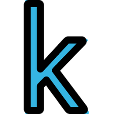
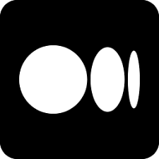
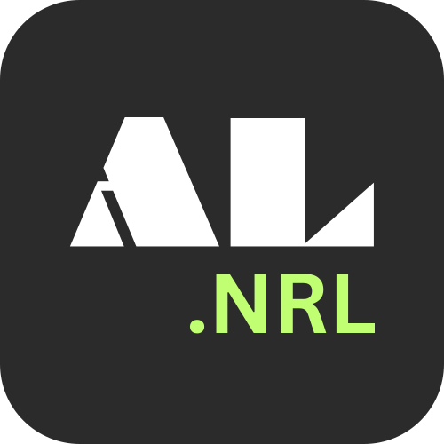
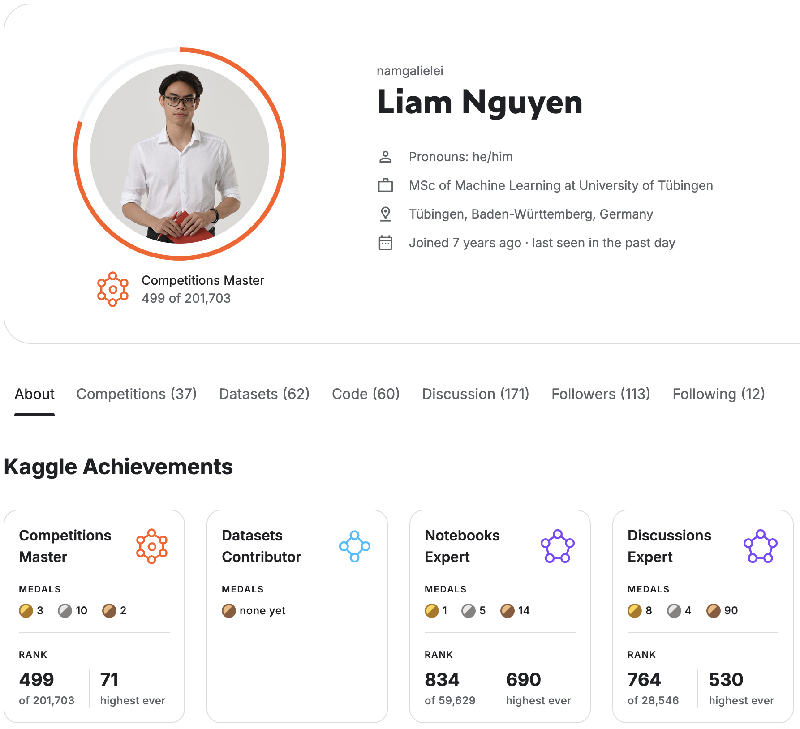

## 👋 Hi!, I'm The Nam (Liam) Nguyen 
**ML Engineer | MSc. Machine Learning at Tübingen University**

> **I build large language models and vision language models**

Hallo! 👋 I view the world as a stochastic process. Uncertainty is the only thing that is unchanged in this fast-changing world. I love building machine learning models to catch the signal from the noise. Large language models and vision language models are my favorite toys. Their ability to generalize always amazes me. I also believe in the future of democratizing AI. That's why I build open-source tools to make AI more accessible, more useful and intuitive to everyone.

### 🎯 About me

- **Skills:** Machine Learning (Probabilistic & Statistical ML, Reinforcement Learning, Deep Learning), Computer Vision, Large Language Models (LLMs), Vision Language Models (VLMs), Data Structures & Algorithms.
- **Education:** MSc. Machine Learning at Tübingen University, Germany.
- **Kaggle:**  [kaggle.com/namgalielei](https://www.kaggle.com/namgalielei) - Kaggle Competition Master.
- **HuggingFace:**   [huggingface.co/thenam](https://huggingface.co/thenam).
- **Writter at:**  [The Nam's Medium](https://medium.com/@namnguyenthe) - AI & ML articles.
- **LinkedIn:**  [linkedIn/thenam](https://www.linkedin.com/in/thenam/) (The Nam Nguyen).

### 🚀 Projects and Products

**Open Source Projects:**

- [LlamaAssistant](https://github.com/vietanhdev/llama-assistant) 🦙 - LLM assistant that rus on your local machine. Support OCR, RAG, reasoning, and more.

**Products:**
- [AnyLearning](https://anylearning.nrl.ai/)  - Desktop app for computer vision model training and inference. Secure your data by training on your own machine. Support various tasks: Object Detection, Segmentation, Classification, etc.

### 📈 GitHub Stats

###  Kaggle

- 1st Place (Gold Medal) in [UW-Madison GI Tract Image Segmentation](https://www.kaggle.com/competitions/uw-madison-gi-tract-image-segmentation). Code: [CarnoZhao/Kaggle-UWMGIT](https://github.com/CarnoZhao/Kaggle-UWMGIT)
- 6th Place (Gold Medal) in [RSNA-MICCAI Brain Tumor Radiogenomic Classification](https://www.kaggle.com/competitions/rsna-miccai-brain-tumor-radiogenomic-classification). Code: [gallegi/T4E_MICCAI_BrainTumor](https://github.com/gallegi/T4E_MICCAI_BrainTumor)
- 7th Place (Gold Medal) in [Sartorius - Cell Instance Segmentation](https://www.kaggle.com/competitions/sartorius-cell-instance-segmentation). Code: [gallegi/T4E_Sartorius_Cell_InstanceSegmentation](https://github.com/gallegi/T4E_Sartorius_Cell_InstanceSegmentation)

### 🌲 DSA Hobby
- I practice Leetcode to remain sharp in algorithmic thinking.
  

### 🤝 Let's Connect!
I'm open to collaborating on AI/ML projects. If you have any questions, feel free to reach out to me at [namnguyen61031@gmail.com](mailto:namnguyen61031@gmail.com).
